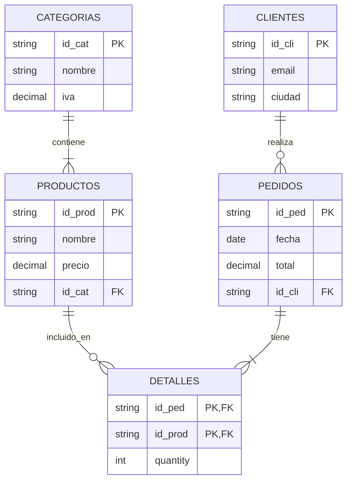

## 📊 Diagrama del Esquema (EER)

 Estructura del Proyecto

## 📂 Estructura del Repositorio

proyecto-algebra-relacional/
├── docker-compose.yml      # Orquestador de servicios (App + DB)
├── README.md               # Documentación principal
├── app/
│   ├── Dockerfile          # Configuración de imagen Python
│   ├── main.py             # Código fuente del Menú Interactivo
│   └── requirements.txt    # Dependencias (psycopg2, tabulate)
└── db/
    └── init.sql            # Script SQL: Creación de tablas y datos semilla
