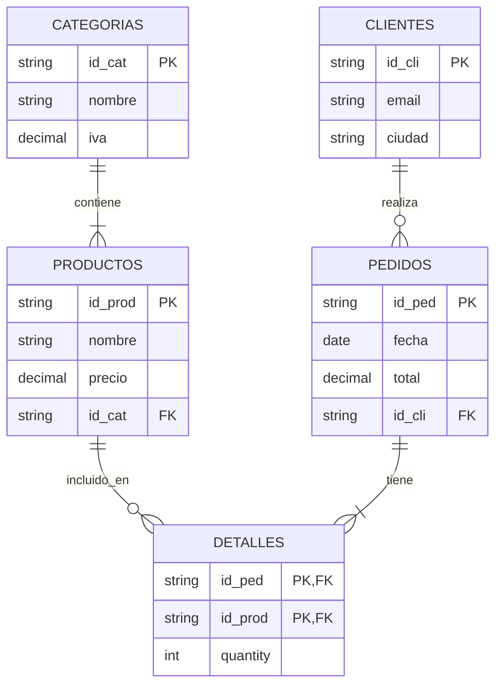

## 📊 Diagrama del Esquema (EER)


 Estructura del Proyecto


## 📂 Estructura del Repositorio

```text
proyecto-algebra-relacional/
├── docker-compose.yml      # Orquestador de servicios (App + DB)
├── README.md               # Documentación principal
├── app/
│   ├── Dockerfile          # Configuración de imagen Python
│   ├── main.py             # Código fuente del Menú Interactivo
│   └── requirements.txt    # Dependencias (psycopg2, tabulate)
└── db/
    └── init.sql            # Script SQL: Creación de tablas y datos semilla
```
## Tabla de equivalencias teóricas

```markdown
## 🎓 Equivalencias Teóricas

Este proyecto demuestra la traducción práctica de operadores matemáticos a SQL:

| Operador | Símbolo | Concepto | Implementación SQL |
| :--- | :---: | :--- | :--- |
| **Selección** | $\sigma$ | Filtrado de filas | `WHERE condicion` |
| **Proyección** | $\pi$ | Selección de columnas | `SELECT col1, col2` |
| **Reunión** | $\bowtie$ | Combinación de tablas | `JOIN ... ON ...` |
| **Agrupación** | $\gamma$ | Agrupar por atributo | `GROUP BY` |
| **División** | $\div$ | Totalidad ("Para todo") | `NOT EXISTS (EXCEPT)` |
| **Diferencia** | $-$ | Resta de conjuntos | `EXCEPT` o `NOT IN` |
```

