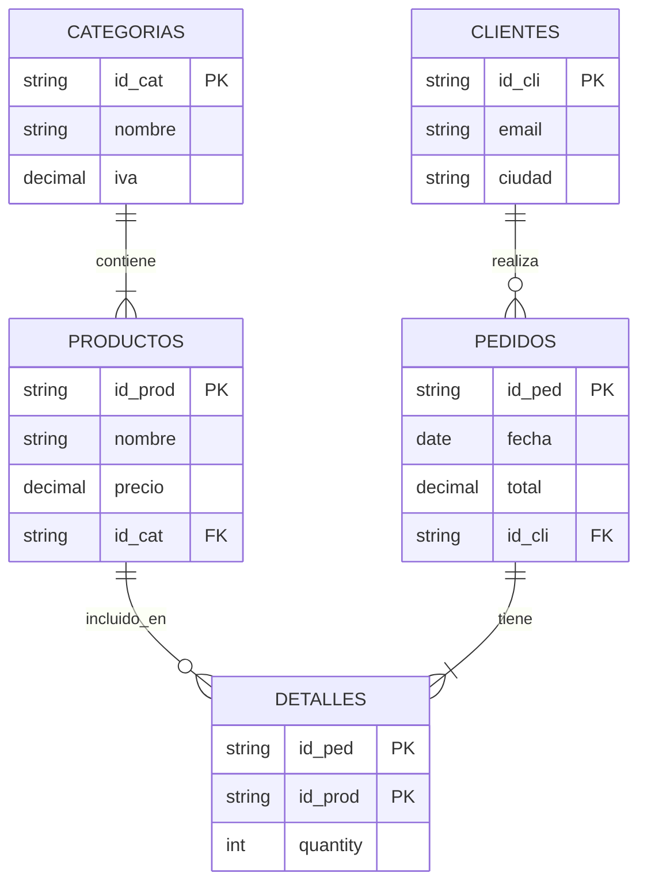

# TechStore - Sistema de Gestión con Álgebra Relacional y SQL 🛒

Este proyecto implementa un sistema de base de datos para una tienda de electrónica ("TechStore"), demostrando la equivalencia y aplicación práctica de **Álgebra Relacional**, **Cálculo Relacional** y **SQL Estándar**.

El sistema está completamente dockerizado e incluye un menú interactivo en Python para ejecutar y visualizar 20 consultas complejas.

**Integrantes del Equipo:**
* [Tu Nombre Completo Aquí]
* [Nombre de tu compañero (si aplica)]

---

## 📋 Descripción del Dominio

El proyecto modela el flujo operativo de una tienda en línea especializada en tecnología, gestionando:
* **Inventario:** Productos clasificados por categorías con control de stock.
* **Ventas:** Pedidos realizados por clientes, con seguimiento de estados y métodos de pago.
* **Clientes:** Información de contacto y ubicación para envíos.
* **Detalle de Compras:** Relación detallada de productos por pedido (cantidad, precio unitario).

### Modelo Relacional (Esquema)
1. **CATEGORIAS** (`id_cat` PK, `nombre`, `descripcion`, `iva_porcentaje`)
2. **PRODUCTOS** (`id_prod` PK, `nombre`, `marca`, `precio`, `stock`, `id_cat` FK)
3. **CLIENTES** (`id_cli` PK, `nombre`, `apellido`, `email`, `ciudad`, `telefono`)
4. **PEDIDOS** (`id_ped` PK, `fecha`, `estado`, `metodo_pago`, `total`, `id_cli` FK)
5. **DETALLES** (`id_ped` FK, `id_prod` FK, `cantidad`, `precio_unitario`, `descuento`)

---

## 📊 Diagrama del Esquema (EER)



## 📂 Estructura del Repositorio
```text
proyecto-algebra-relacional/
├── docker-compose.yml      # Orquestador de servicios (App + DB)
├── README.md               # Documentación principal
├── app/
│   ├── Dockerfile          # Configuración de imagen Python
│   ├── main.py             # Código fuente del Menú Interactivo
│   └── requirements.txt    # Dependencias (psycopg2, tabulate)
└── db/
    └── init.sql            # Script SQL: Creación de tablas y datos semilla
```
## 🚀 Instalación y Ejecución

Este proyecto utiliza Docker y Docker Compose para un despliegue inmediato y aislado. No requiere instalar PostgreSQL ni Python localmente.

Prerrequisitos
Tener instalado Docker Desktop (o Docker Engine + Compose).

Pasos para ejecutar
1. Clonar el repositorio:
   git clone <URL_DE_TU_REPOSITORIO>
    cd proyecto-algebra-relacional

2. Construir y levantar los contenedores: Este comando descarga la imagen de Postgres, construye la aplicación Python e inicializa la base de datos automáticamente.
   docker-compose up -d --build

3. Ingresar al Menú Interactivo: Una vez que los contenedores estén corriendo, ejecuta:
   docker attach techstore_menu
    (Nota: Si el menú no aparece de inmediato, presiona ENTER una vez).

4. Detener el sistema: Para apagar los contenedores y liberar recursos:
   docker-compose down

   

##🧠 Consultas Implementadas
El sistema incluye 20 consultas clasificadas por complejidad. A continuación se detallan los tipos de operaciones cubiertas:

| Categoría | Operadores / Conceptos | Descripción y Ejemplo |
| :--- | :--- | :--- |
| **1. Operadores Básicos** | $\sigma, \pi, \cup, -, \cap$ | Consultas de selección, proyección y conjuntos. <br> *Ej: Listar productos de una marca o unión de catálogos.* |
| **2. Reuniones (Joins)** | $\bowtie, \leftouterjoin, \triangleright$, Self-Join | Conexión de múltiples tablas. <br> *Incluye: Natural Join, Left Outer Join y Anti-Join.* |
| **3. Agregación** | `SUM, AVG, GROUP BY` | Cálculo de estadísticas y reportes. <br> *Ej: Promedio de precios por marca, ventas por cliente.* |
| **4. División (Desafío)** | $\div$ (Simulado) | Operaciones de totalidad. <br> *Ej: "Clientes que compraron TODOS los productos de X".* |
| **5. Lógica Predicados** | $\forall, \exists$ | Consultas basadas en cuantificadores universales y existenciales. |

## 🎓 Equivalencias Teóricas
Este proyecto demuestra la traducción práctica de operadores matemáticos a SQL:

| Operador | Símbolo | Concepto | Implementación SQL |
| :--- | :---: | :--- | :--- |
| **Selección** | $\sigma$ | Filtrado de filas | `WHERE condicion` |
| **Proyección** | $\pi$ | Selección de columnas | `SELECT col1, col2` |
| **Reunión** | $\bowtie$ | Combinación de tablas | `JOIN ... ON ...` |
| **Agrupación** | $\gamma$ | Agrupar por atributo | `GROUP BY` |
| **División** | $\div$ | Totalidad ("Para todo") | `NOT EXISTS (EXCEPT)` |
| **Diferencia** | $-$ | Resta de conjuntos | `EXCEPT` o `NOT IN` |
## 🛠 Tecnologías Utilizadas
- PostgreSQL 15: Motor de base de datos relacional.

- Python 3.9: Lenguaje para la interfaz de línea de comandos (CLI).

- Psycopg2: Adaptador de base de datos para Python.

- Docker Compose: Orquestación de servicios (App + DB).

- Git: Control de versiones.
## 🔧 Solución de Problemas Comunes
1. Error: puerto 5432 ocupado Si tienes PostgreSQL instalado localmente en tu máquina, Docker fallará.

Solución: Detén tu servicio local de Postgres o cambia el puerto en docker-compose.yml (ej. "5433:5432").

2. El menú se cierra inmediatamente Si al ejecutar docker attach no ves nada.

Solución: Presiona la tecla ENTER una vez. Si el contenedor se detuvo, reinícialo con docker start techstore_menu.

3. Error de conexión a Base de Datos Si la aplicación dice "Esperando a la base de datos..." por mucho tiempo.

Solución: Asegúrate de que el contenedor de base de datos esté sano (healthy) ejecutando docker ps.
